###  NOTE: We develop OneDev at https://code.onedev.io/projects/onedev-server for sake of dogfooding. All issues and pull requests should be created there

# Super Easy All-In-One DevOps Platform 

With Issue Tracking, Git Management, Pull Request, and Build Farm. Simple yet Powerful.

| <a href="https://code.onedev.io/projects/onedev-manual/blob/main/pages/5min-tutorial.md">A Five Minutes Tutorial</a> 
| <a href="https://code.onedev.io/projects/onedev-manual/blob/main/pages/installation-guide.md">Installation Guide</a> 
| <a href="https://code.onedev.io/projects/onedev-manual/blob/main/pages/usage-scenarios.md">Usage Scenarios</a>
| <a href="https://code.onedev.io/projects/onedev-manual/blob/main/pages/development-guide.md">Development Guide</a>
| <a href="https://code.onedev.io/projects/onedev-manual/blob">All Documentations</a> |

### Docker First Kubernetes Native Build Farm

Trivial to set up a build farm to run massive CI builds as pods in Kubernetes. No agents or runners required. Transparent support for Linux and Windows containers. 

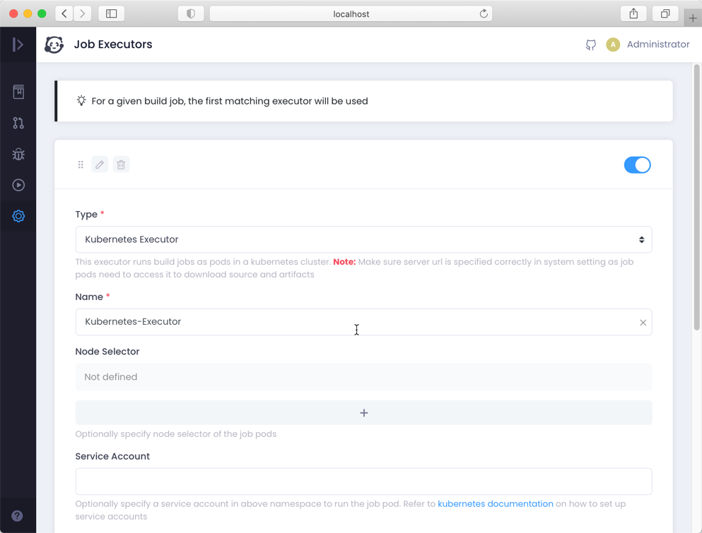

### Create Build Spec in a Breeze

Build spec is defined in a yaml file together with your code, and OneDev provides a GUI to create the build spec without any learning curve.

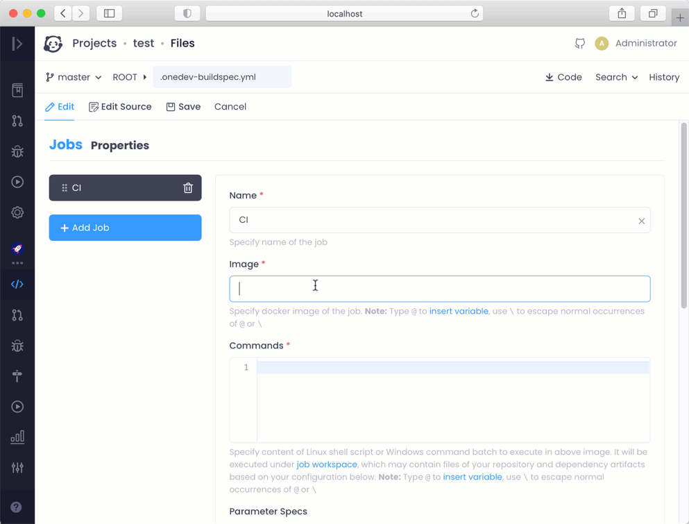

### Flexible Build Workflow and Pipeline

Conditional build parameters. Create matrix builds by combining different parameters. Connect jobs to create pipelines. Run jobs concurrently to speed up processing. Run jobs automatically upon certain events, or manually by authorized users

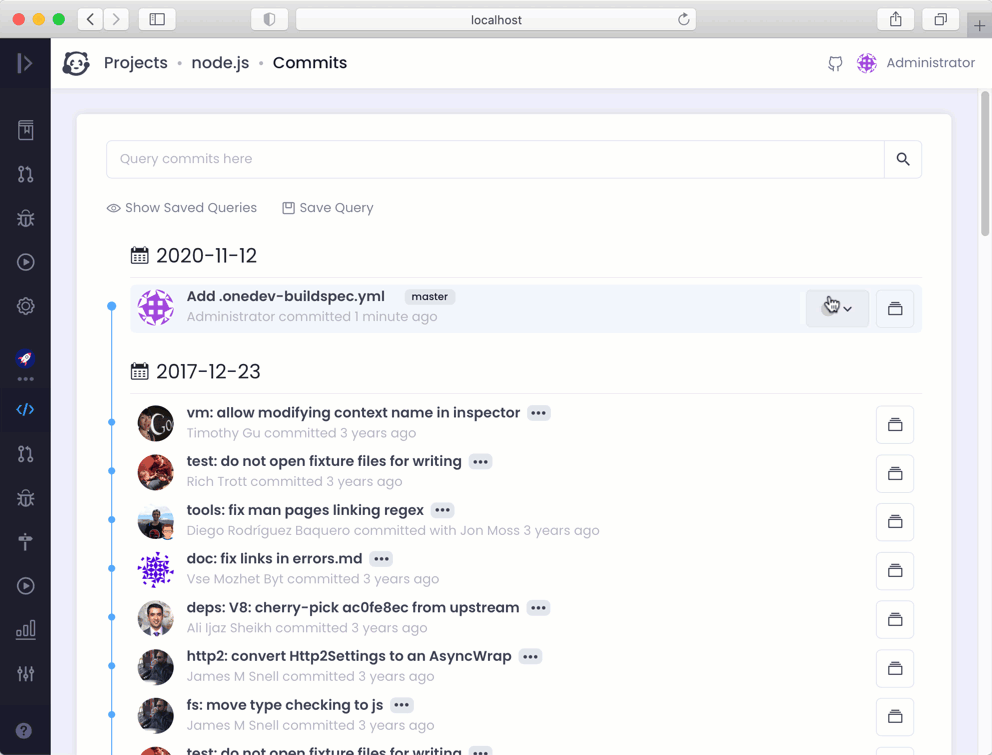

### Custom Issue States and Fields

Add custom issue states and fields. Configure field dependencies. Transit issue state automatically upon certain events, or manually by authorized users 

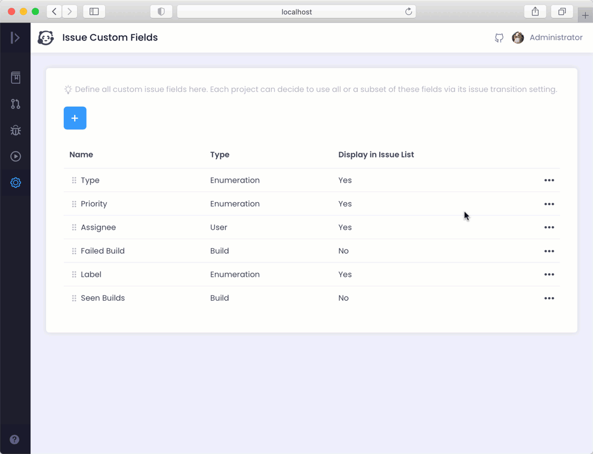

### Auto-Refreshing Issue Boards

Define issue boards to show issues in columns based on values of specified field. Perform issue operations without leaving the board. Refresh board automatically to reflect most recent issue state.

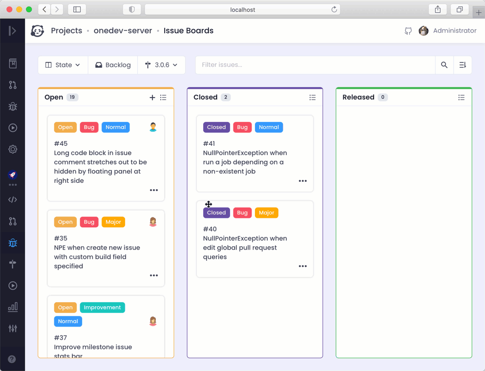

### Code Intelligence

Symbol search and navigation in source code and diff. Outline display and search. Works for every commit. Currently supports Java, JavaScript, C, C++, CSharp, Go, PHP, Python, CSS, SCSS, LESS and R. 

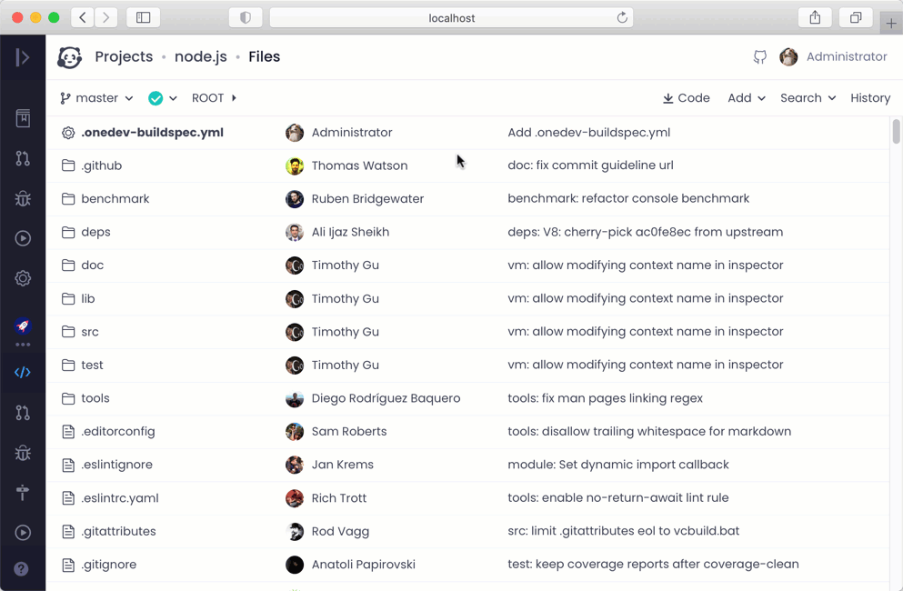

### Code Discussions and Comprehensions

Instant and lightweight code discussions on code and diff blocks without creating pull requests. Discussions stay with the code to help code comprehension even if file is changed or renamed. 

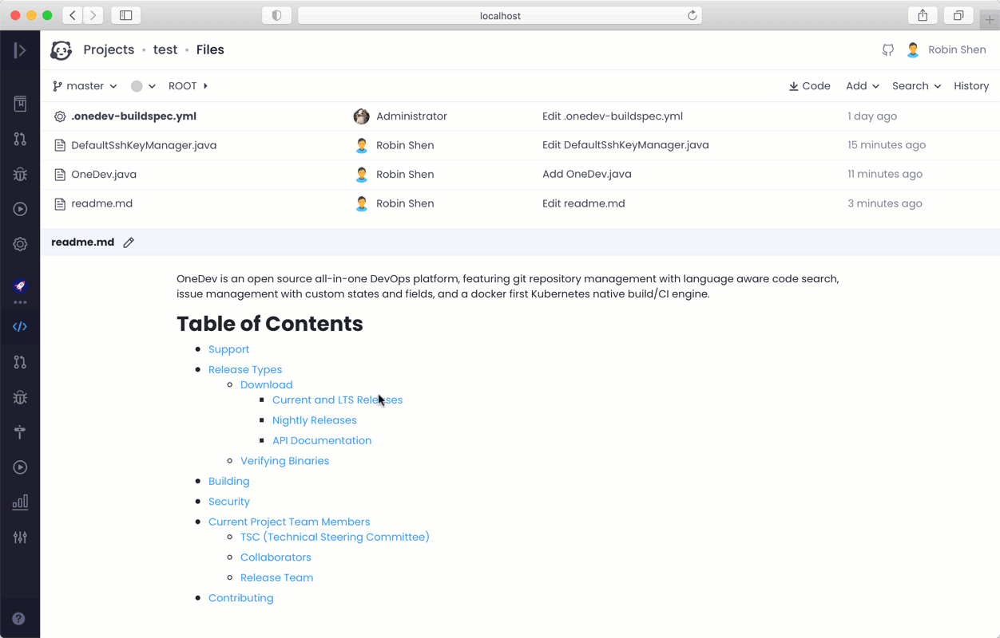

### Flexible Pull Request Review Policies

Enforce pull request review with branch protections. Specify required reviewers and builds for desired file patterns. 

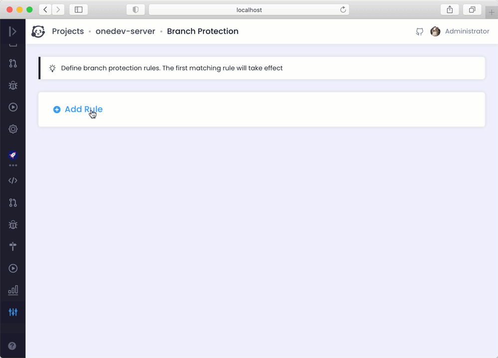

### Painless Pull Request Review

Review pull request commits as a whole or one by one. Organize code discussions in threads to show changes since last review explicitly

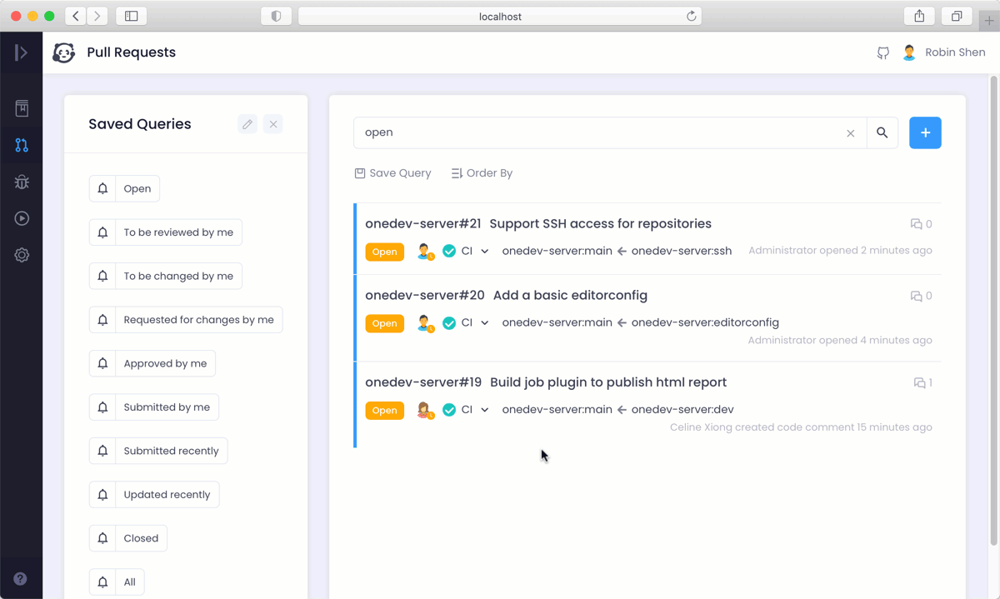

### Powerful Query Language

Perform sophisticated queries against projects, commits, builds, issues, pull requests or code comments with a powerful query language. Save query for quick access. Subscribe to saved query to get notified of interesting events.

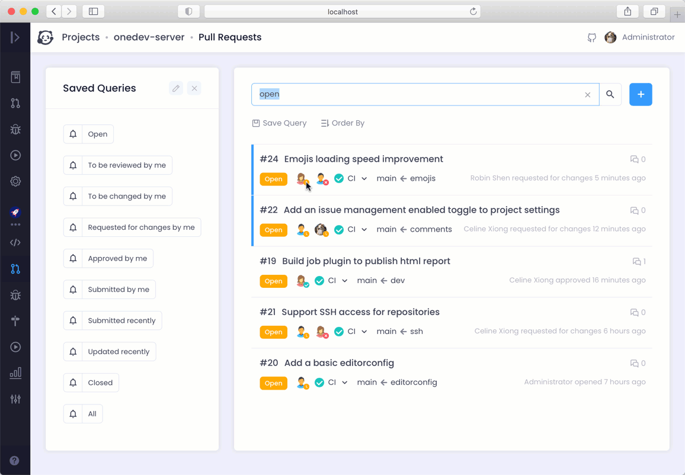

### Deep Integration of Code, Issue, Pull Request and Build

Configure issues to transit to desired state upon commit, build or pull request events. See commit and pull request events in issue activities. Query fixed issues between builds. Find builds or pull requests fixing particular issues or commits

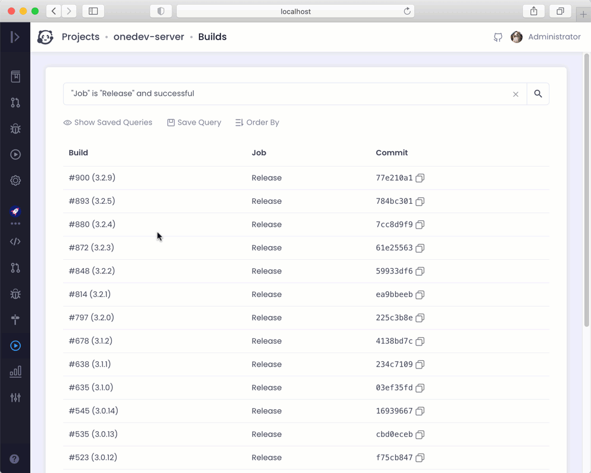

### Fine Grained Permission Control

Define permission schemes best suiting your development workflow. For instance, you may specify who can change particular source folder, who can assign issues, who can run release builds, or who can access build log, etc.

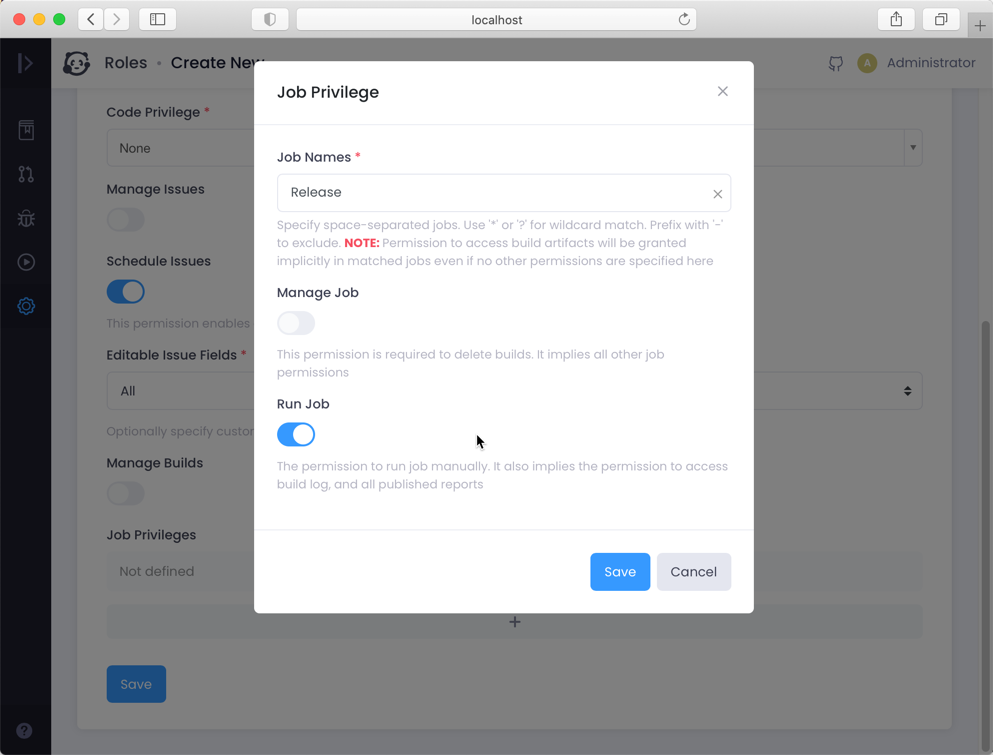
